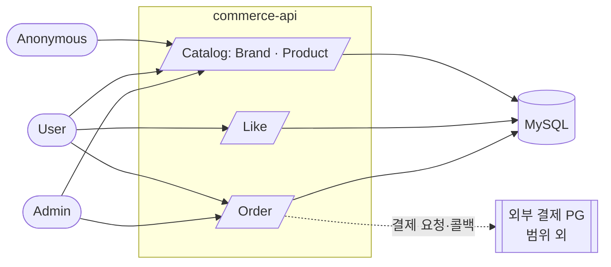

# 01. 요구사항 명세

> 루프팩 BE L2 Round 2 — 감성 이커머스의 **상품 / 브랜드 / 좋아요 / 주문** 도메인 요구사항을 정리한다.
> 회원가입·내 정보 조회는 vol.1 에서 구현되어 본 문서의 범위 밖이다. 결제·포인트·외부 시스템 연동은 후속 단계에서 다루며 본 문서에서는 경계만 표기한다.

## 목차

1. [유비쿼터스 언어 사전](#1-유비쿼터스-언어-사전)
2. [액터 & 시스템 컨텍스트](#2-액터--시스템-컨텍스트)
3. [유저 시나리오](#3-유저-시나리오)
4. [도메인별 기능 명세](#4-도메인별-기능-명세)
   - [4.1 브랜드](#41-브랜드)
   - [4.2 상품](#42-상품)
   - [4.3 좋아요](#43-좋아요)
   - [4.4 주문](#44-주문)
   - [4.5 결제·포인트 (참고)](#45-결제포인트-참고)
5. [비기능 요구사항](#5-비기능-요구사항)
6. [Open Questions](#6-open-questions)

---

## 1. 유비쿼터스 언어 사전

문서·코드·DB 컬럼·API 표현에서 **동일한 영문 표기**를 사용한다. 새 용어 도입 시 본 사전을 먼저 확장한다.

| 한글 | 영문 (코드) | 정의 |
| --- | --- | --- |
| 사용자 | `User` | 서비스를 이용하는 일반 고객. `X-Loopers-LoginId` 로 식별한다. |
| 어드민 | `Admin` | `users.role == ADMIN` 인 운영자 사용자. `X-Loopers-Ldap` 헤더로 식별한다. |
| 역할 | `Role` (enum) | `USER` / `ADMIN`. `users.role` 컬럼으로 저장한다. 권한 분기의 일차 기준. |
| 브랜드 | `Brand` | 상품의 소속 단위. 어드민이 등록·수정·삭제한다. |
| 상품 | `Product` | 사용자에게 판매되는 단위. 반드시 하나의 브랜드에 속한다. |
| 가격 | `price` (Long) | 상품의 금액. 0 이상의 정수. 원시값으로 보관한다. |
| 재고 | `Stock` (VO) | 상품의 보유 수량. 차감·증가 규칙을 캡슐화한다. 음수가 될 수 없다. |
| 좋아요 | `Like` | (User, Product) 조합당 최대 1개. 등록·취소가 멱등이다. |
| 주문 | `Order` | 사용자가 1개 이상의 상품을 한 번에 구매하는 단위. |
| 주문 항목 | `OrderItem` | 주문의 라인. 주문 시점의 상품 정보를 스냅샷으로 가진다. |
| 상품 스냅샷 | `Product Snapshot` | 주문 시점의 상품명·단가. 이후 상품이 변경/삭제되어도 불변. |
| 주문 상태 | `OrderStatus` | `PENDING` / `PAID` / `CANCELED`. |
| 결제 | `Payment` *(설계 범위 외)* | 주문 시퀀스 내 외부 step 으로만 표기. |
| 포인트 | `Point` *(설계 범위 외)* | 결제 시 사용 가능한 가상 통화. |

---

## 2. 액터 & 시스템 컨텍스트

### 2.1 액터

| 액터 | 식별 헤더 | 검증 방식 | 권한 요약 |
| --- | --- | --- | --- |
| `User` | `X-Loopers-LoginId`, `X-Loopers-LoginPw` | `users.login_id` 매칭 (vol.1) | 상품 탐색, 좋아요 등록·취소, 자신의 주문 생성·조회 |
| `Admin` | `X-Loopers-Ldap` | 헤더 값으로 `users.login_id` 조회 → `role == ADMIN` 검증 | 브랜드·상품 CRUD, 모든 주문 조회 |
| `Anonymous` | (헤더 없음) | — | 상품·브랜드 조회 (대고객 일부 GET) |

> **본 라운드의 단순화 가정** : 실제 LDAP/SSO 시스템 연동은 범위 밖이다. `X-Loopers-Ldap` 헤더 값을 곧바로 `users.login_id` 와 매칭하는 것으로 대체한다. 시드 단계에서 `login_id = 'loopers.admin', role = 'ADMIN'` 사용자를 미리 생성해둔다. 실제 LDAP 연동 모델링은 [§6 Open Questions](#6-open-questions) 참고.
> 사용자는 타 사용자의 정보에 직접 접근할 수 없다.

### 2.2 시스템 컨텍스트



---

## 3. 유저 시나리오

### [S-1] 상품 탐색
사용자(또는 익명)는 브랜드 페이지에 진입하거나 전체 상품 목록을 둘러본다. `brandId` 로 필터링하고, `sort` (`latest` / `price_asc` / `likes_desc`) 와 `page` · `size` 로 페이징한다. 상품 상세 페이지에서 가격·재고·좋아요 수를 확인한다.

### [S-2] 좋아요 토글
사용자는 마음에 드는 상품에 좋아요를 등록한다. 동일 상품에 다시 등록을 시도해도 결과는 동일하다. 좋아요 취소도 같은 멱등 규칙이 적용된다. 마이페이지에서 자신이 좋아요 한 상품 목록을 조회할 수 있다.

### [S-3] 주문 생성
사용자는 1개 이상의 상품(상품 ID, 수량)을 선택해 주문을 요청한다. 시스템은 단일 트랜잭션에서 다음을 수행한다.
1. 각 상품의 존재·`ON_SALE` 상태·재고를 검증
2. 재고를 차감
3. 주문 시점의 상품 정보를 스냅샷으로 보존
4. `Order` 를 `PENDING` 상태로 생성

검증·차감 중 하나라도 실패하면 전체 주문이 실패한다. 결제 흐름은 본 설계 범위 밖이며, 별도 단계에서 `PENDING → PAID` 전이가 일어난다.

### [S-4] 주문 조회
사용자는 기간(`startAt`, `endAt`)으로 자신의 주문 목록을 조회하고, 주문 ID 로 상세를 조회한다. 타인의 주문은 조회할 수 없다.

### [S-5] 어드민 운영
어드민은 브랜드를 등록·수정·삭제하고, 상품을 등록·수정(브랜드 변경 불가)·삭제한다. 브랜드 삭제 시 그 브랜드에 속한 상품들도 함께 삭제된다(soft). 어드민은 전체 주문 목록과 상세를 조회할 수 있다.

---

## 4. 도메인별 기능 명세

각 도메인은 **User API → Admin API → 정책·제약** 순으로 정리한다.

### 4.1 브랜드

#### User API

| METHOD | URI | 설명 |
| --- | --- | --- |
| GET | `/api/v1/brands/{brandId}` | 브랜드 정보 조회 |

#### Admin API

| METHOD | URI | 설명 |
| --- | --- | --- |
| GET | `/api-admin/v1/brands?page=0&size=20` | 등록된 브랜드 목록 조회 |
| GET | `/api-admin/v1/brands/{brandId}` | 브랜드 상세 조회 |
| POST | `/api-admin/v1/brands` | 브랜드 등록 |
| PUT | `/api-admin/v1/brands/{brandId}` | 브랜드 정보 수정 |
| DELETE | `/api-admin/v1/brands/{brandId}` | 브랜드 삭제 (소속 상품도 함께 soft delete) |

#### 정책·제약
- **이름 unique** — DB `UNIQUE (name)` (활성/비활성 무관). 동일 이름의 soft delete 된 브랜드가 있는 상태에서 `POST /api-admin/v1/brands` 요청이 오면, `BrandFacade` 가 해당 행을 자동 `restore` 하고 요청 필드를 반영한다 (새 INSERT 하지 않음). 즉, "브랜드 이름" 은 영구 식별자다.
- **Soft delete** — `deleted_at` 으로 관리한다. 모든 조회는 `deleted_at IS NULL` 조건을 가진다.
- **Cascade soft delete** — 브랜드 삭제 시 해당 브랜드의 상품들도 동일 시점 `deleted_at` 으로 표시한다.

---

### 4.2 상품

#### User API

| METHOD | URI | 설명 |
| --- | --- | --- |
| GET | `/api/v1/products` | 상품 목록 조회 (필터·정렬·페이징) |
| GET | `/api/v1/products/{productId}` | 상품 상세 조회 |

##### 목록 쿼리 파라미터

| 파라미터 | 예시 | 설명 |
| --- | --- | --- |
| `brandId` | `1` | 특정 브랜드의 상품만 필터링 |
| `sort` | `latest` / `price_asc` / `likes_desc` | 정렬 기준. 기본값 `latest` |
| `page` | `0` | 페이지 번호. 기본값 `0` |
| `size` | `20` | 페이지당 상품 수. 기본값 `20` |

#### Admin API

| METHOD | URI | 설명 |
| --- | --- | --- |
| GET | `/api-admin/v1/products?page=0&size=20&brandId={brandId}` | 등록된 상품 목록 조회 |
| GET | `/api-admin/v1/products/{productId}` | 상품 상세 조회 |
| POST | `/api-admin/v1/products` | 상품 등록 (`brandId` 는 이미 등록된 브랜드여야 함) |
| PUT | `/api-admin/v1/products/{productId}` | 상품 정보 수정 (`brandId` 는 변경 불가) |
| DELETE | `/api-admin/v1/products/{productId}` | 상품 삭제 |

#### 정책·제약
- **상태(`ProductStatus`)** — `ON_SALE` / `HIDDEN` 두 값만 갖는다. 품절은 별도 상태가 아니라 `stock = 0` 으로 판단한다.
- **대고객 노출 조건** — `deleted_at IS NULL AND status = ON_SALE` 만 대고객 조회·주문 가능.
- **어드민 노출 조건** — `deleted_at IS NULL` (status 무관). 어드민은 HIDDEN 상품도 본다.
- **가격·재고 음수 불가** — 가격은 0 이상, 재고는 0 이상 정수.
- **브랜드 불변** — 등록 후 `brandId` 변경 불가.
- **Soft delete** — 브랜드와 동일 정책.
- **좋아요 수** — 상품 본문 컬럼(`like_count`)으로 관리한다 (4.3 참고).

---

### 4.3 좋아요

#### User API

| METHOD | URI | 설명 |
| --- | --- | --- |
| POST | `/api/v1/products/{productId}/likes` | 상품 좋아요 등록 (멱등) |
| DELETE | `/api/v1/products/{productId}/likes` | 상품 좋아요 취소 (멱등) |
| GET | `/api/v1/users/{userId}/likes` | 본인이 좋아요 한 상품 목록 조회 |

#### 정책·제약
- **삭제 정책 — hard delete** — `Like` 는 본 도메인에서 유일하게 hard delete 를 사용한다. 좋아요 취소 시 행을 물리적으로 제거한다. 이력 보존 손실을 감수하고 unique 제약 충돌을 단순화하기 위함이다.
- **고유성** — `(user_id, product_id)` 조합은 최대 1개. DB unique 제약 (단순 `UNIQUE (user_id, product_id)`) 으로 강제한다.
- **멱등성** — POST 를 N 번 호출해도 좋아요는 1개만 존재한다. DELETE 도 N 번 호출해도 결과가 동일하다.
  - 구현 정책: 등록 시 unique 제약 위반은 정상 동작으로 흡수(INSERT IGNORE / upsert), 취소 시 미존재는 no-op.
- **좋아요 수 보관** — `Product.like_count` 컬럼에 역정규화하여 보관. 좋아요 등록·취소 시 같은 트랜잭션에서 원자적으로 `+1` / `-1`.
  - 동기 갱신을 통해 정합성을 보장한다. 비동기 집계는 도입하지 않는다.
- **본인만 조회 가능** — `GET /api/v1/users/{userId}/likes` 는 로그인한 본인의 `userId` 와 일치할 때만 허용한다.
- **상품 삭제 시** — 상품 soft delete 시 `Like` 행은 그대로 둔다. "내 좋아요 목록" 조회 시 `products` 와 join 하여 `products.deleted_at IS NULL` 인 상품만 노출한다 (조회 단계 필터).

---

### 4.4 주문

#### User API

| METHOD | URI | 설명 |
| --- | --- | --- |
| POST | `/api/v1/orders` | 주문 요청 |
| GET | `/api/v1/orders?startAt=YYYY-MM-DD&endAt=YYYY-MM-DD` | 본인 주문 목록 조회 (기간) |
| GET | `/api/v1/orders/{orderId}` | 본인 주문 상세 조회 |

##### 요청 예시

```json
{
  "items": [
    { "productId": 1, "quantity": 2 },
    { "productId": 3, "quantity": 1 }
  ]
}
```

> 가격은 클라이언트가 보내지 않는다. 서버가 DB 의 현재 가격으로 계산한다.

#### Admin API

| METHOD | URI | 설명 |
| --- | --- | --- |
| GET | `/api-admin/v1/orders?page=0&size=20` | 전체 주문 목록 조회 |
| GET | `/api-admin/v1/orders/{orderId}` | 단일 주문 상세 조회 |

#### 정책·제약
- **주문 상태 전이** — `PENDING → PAID`, `PENDING → CANCELED`, `PAID → CANCELED`.
  ```
  ┌─────────┐  결제 성공   ┌──────┐
  │ PENDING ├─────────────►│ PAID │
  └────┬────┘              └──┬───┘
       │ 결제 실패 / 취소        │ 환불
       ▼                       ▼
   ┌───────────┐           ┌──────────┐
   │ CANCELED  │◄──────────│ CANCELED │
   └───────────┘           └──────────┘
  ```
- **가격 계산** — 서버가 각 라인의 `unit_price = Product.price` 로 잡고 `line_total = unit_price × quantity` 를 계산하며, 주문 합계 `total_price = Σ line_total` 를 산출한다.
- **상품 스냅샷** — `OrderItem` 은 주문 시점의 다음 값을 보존한다.
  - `product_id`
  - `product_name` (당시 상품명)
  - `unit_price` (당시 단가)
  - `quantity`
  - `line_total`
- **주문 가능 조건** — 모든 라인의 상품이 `deleted_at IS NULL AND status = ON_SALE AND stock ≥ quantity` 이어야 한다.
- **재고 차감 시점** — 주문 생성과 동일한 트랜잭션에서 즉시 차감한다. `Order(PENDING)` 생성과 재고 차감이 원자적으로 함께 일어난다.
- **부분 실패 = 전체 실패** — 라인 중 하나라도 검증·차감에 실패하면 전체 주문이 실패한다 (all-or-nothing).
- **취소 시 재고 복구** — `CANCELED` 전이 시 차감했던 수량만큼 `stock` 을 복구한다 (정책 선언. 트리거 구현은 결제 도메인 단계에서 다룸).
- **멀티 브랜드 허용** — 한 주문에 여러 브랜드의 상품을 함께 담을 수 있다.
- **본인만 조회** — 사용자는 자신이 생성한 주문만 조회한다. 어드민은 전체 주문을 조회한다.
- **기간 조회** — `startAt`, `endAt` 은 주문 생성일 기준. 누락 시 기본값은 후속 단계에서 정의.

---

### 4.5 결제·포인트 (참고)

> 본 설계의 범위 밖. 시퀀스·도메인 모델·ERD 에서는 다음 수준으로만 표현한다.

- 결제는 외부 PG 와 연동되는 별도 step 으로 표기한다.
- `PENDING → PAID` 전이는 외부 결제 콜백/결과에 의해 트리거된다고 가정한다.
- 포인트는 결제 시 사용 가능한 가상 통화로만 언급하고, 본 라운드에서 도메인화하지 않는다.
- 결제·포인트·환불·외부 PG 모델은 후속 라운드에서 별도로 다룬다.

---

## 5. 비기능 요구사항

> 본 라운드에서는 **정책 선언** 수준으로만 명시한다. 구체적 구현 패턴(원자적 UPDATE, 비관·낙관 락, 이벤트 발행 등)은 다음 주 구현 단계에서 비교·결정한다.

### 5.1 멱등성

- **좋아요 등록/취소** 는 동일 요청을 N 번 호출해도 결과가 같다.
- **주문 생성** 은 본 라운드에서는 단발 요청을 가정한다. 재시도 멱등 보장(Idempotency-Key 등)은 결제 도메인 도입 시점에 함께 도입한다 (Open Questions).

### 5.2 동시성

- **재고 차감** 은 동시 주문 요청에서도 음수 재고가 발생하지 않아야 한다.
- **좋아요 수** 는 동시 등록·취소에서도 `Like` 레코드 수와 `Product.like_count` 가 일치해야 한다.
- 구체 패턴(원자적 UPDATE / 비관 락 / 낙관 락)은 구현 단계에서 결정한다.

### 5.3 데이터 정합성

- **주문-재고** — 주문 생성 트랜잭션 내에서 `Order(PENDING)` 생성과 재고 차감은 원자적으로 함께 성공·실패한다.
- **주문-스냅샷** — `OrderItem` 의 상품명·단가는 주문 시점에 동결되며, 이후 상품 변경/삭제에도 변하지 않는다.
- **좋아요-좋아요수** — `Like` 등록/취소와 `Product.like_count` 갱신은 동일 트랜잭션에서 수행한다.
- **Soft delete 일관성** — 모든 대고객 조회는 `deleted_at IS NULL` 조건을 포함한다.

---

## 6. Open Questions

| # | 항목 | 메모 |
| --- | --- | --- |
| 1 | 장바구니(Cart) 도입 | 현재 요구사항에는 없음. `POST /orders` 가 `items[]` 를 직접 받음. 추후 도입 시 Cart, CartItem 도메인 추가 + 주문 API 변경 필요. |
| 2 | PENDING 타임아웃 자동 취소 | 결제가 일정 시간 내 완료되지 않은 PENDING 주문의 자동 CANCELED + 재고 복구 정책. 다음 주 결제 도입과 함께 검토. |
| 3 | 사용자 주문 취소 API | 현재 명세에 없음. PENDING/PAID 상태에서 사용자가 직접 취소할 수 있는지 결제 흐름과 함께 검토. |
| 4 | 결제·포인트 도메인 모델링 | 결제 수단, 외부 PG 연동, 환불 흐름, 포인트 적립·차감, 쿠폰 정책 등을 별도 라운드에서 모델링. |
| 5 | 주문 멱등 키 (Idempotency-Key) | 결제 단계 도입 시 함께 검토. 본 라운드에서는 단발 요청 가정. |
| 6 | 주문 기간 조회 기본값 | `startAt` / `endAt` 미지정 시 동작 (최근 N일 / 전체) 을 후속 단계에서 정의. |
| 7 | 좋아요 이력 보존 | `Like` hard delete 정책으로 인해 "과거에 좋아요 한 적 있음" 데이터가 보존되지 않음. 통계/분석 요구가 생기면 이벤트 로그 또는 soft delete 회귀 검토. |
| 8 | 실제 LDAP/SSO 연동 | 본 라운드는 `X-Loopers-Ldap` 헤더를 `users.login_id` 와 단순 매칭으로 처리. 실제 LDAP 연동, 어드민 권한 세분화(상품 어드민 / 주문 어드민 등), `ldap_id` 같은 별도 컬럼 도입은 후속 라운드에서 검토. |
