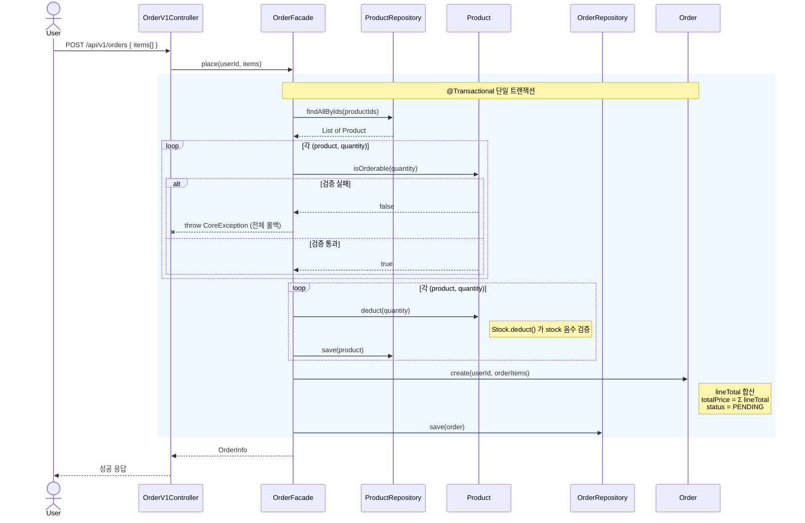
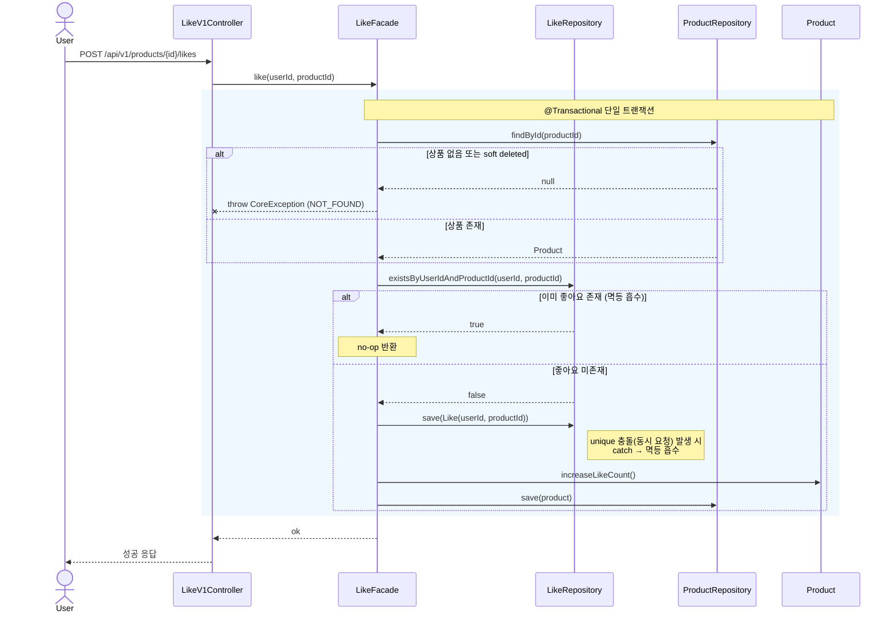
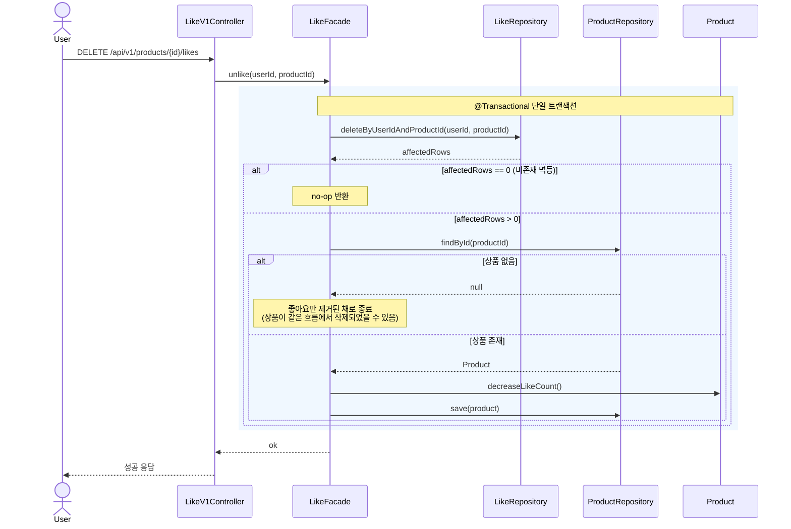
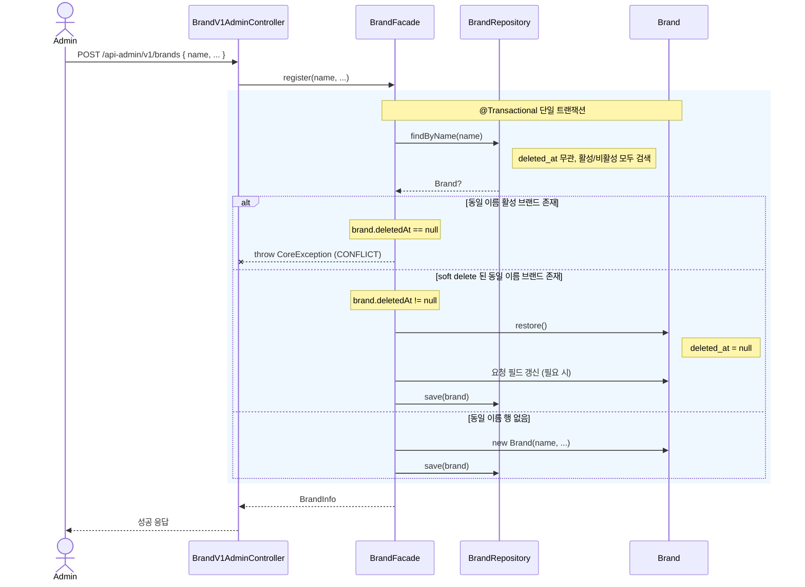
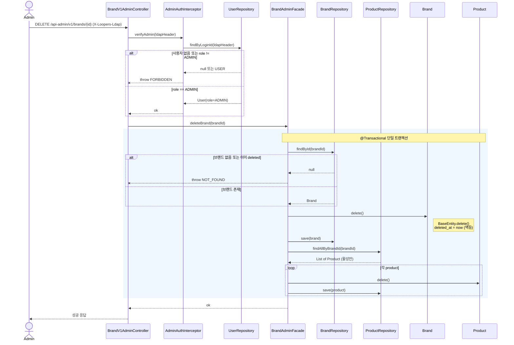

# 02. 시퀀스 다이어그램

> [01. 요구사항](01-requirements.md) / [03. 클래스 다이어그램](03-class-diagram.md) / [04. ERD](04-erd.md) 에서 결정된 정책이 실제 호출 흐름으로 어떻게 드러나는지 시각화한다.
>
> 본 문서는 핵심 시나리오 3개를 다룬다. 각 다이어그램은 **도메인 메서드 호출 수준 + 트랜잭션 경계 + 분기(alt)** 까지 표현한다.

## 목차

1. [표기 규약](#1-표기-규약)
2. [주문 생성 — `POST /api/v1/orders`](#2-주문-생성--post-apiv1orders)
3. [좋아요 등록 / 취소](#3-좋아요-등록--취소)
4. [브랜드 등록 — 자동 restore 흐름](#4-브랜드-등록--자동-restore-흐름)
5. [브랜드 cascade soft delete — `DELETE /api-admin/v1/brands/{brandId}`](#5-브랜드-cascade-soft-delete--delete-api-adminv1brandsbrandid)

---

## 1. 표기 규약

| 표기 | 의미 |
| --- | --- |
| `actor` | 외부 사용자 / 어드민 |
| `participant` | 시스템 컴포넌트 (Controller / Facade / Repository / Aggregate Root) |
| `rect` 박스 + 주석 | `@Transactional` 트랜잭션 경계 |
| `alt / else` | 조건 분기 (성공/실패, 멱등 흡수 등) |
| `--x` | 예외 throw (트랜잭션 롤백) |
| `Note` | 정책·메모 보조 설명 |

> HTTP 상태 코드는 표기하지 않는다 (요구사항 단계에서 미정). "성공 응답" / "예외 응답" 으로만 표시한다.

---

## 2. 주문 생성 — `POST /api/v1/orders`

### 2.1 시나리오 요약
- 사용자가 1개 이상의 `(productId, quantity)` 를 보내 주문을 요청.
- 단일 트랜잭션 안에서 **상품 검증 → 재고 차감 → 스냅샷 저장 → 주문 생성** 을 모두 수행.
- 한 라인이라도 실패하면 전체 롤백 (all-or-nothing).
- 결제는 본 설계 범위 밖. `Order` 는 `PENDING` 으로 생성된다.

### 2.2 책임 분해
- `OrderV1Controller` : 요청 파싱·응답 매핑만.
- `OrderFacade` : 여러 Aggregate(`Product`, `Order`) 조율. 트랜잭션 경계.
- `Product` (Root) : `isOrderable`, `deduct` 자체 검증·차감.
- `Order` (Root) : `create` 팩토리에서 합계 산정.

### 2.3 다이어그램

### 2.4 읽는 포인트
- **검증 루프와 차감 루프가 분리**되어 있다. 한 라인이라도 검증 실패면 차감을 시작하지 않고 즉시 롤백 → all-or-nothing.
- 재고 차감은 같은 트랜잭션 안에서 일어난다 → `Order(PENDING)` 와 재고가 어긋날 수 없다 (정합성).
- `Order.create()` 는 단순 생성자 호출이 아니라 합계 산정·상태 초기화를 책임지는 팩토리.
- 동시 차감의 안전성은 본 다이어그램이 아닌 **구현 단계의 동시성 패턴**(원자적 UPDATE / 락) 에서 다룬다.

### 2.5 잠재 리스크
- 검증 루프 통과 후, 차감 루프 진입 직전에 다른 트랜잭션이 재고를 다 차감해버리면? → 차감 단계에서 음수 검증으로 실패 후 롤백 (안전). 다만 사용자 입장에서는 "조회상 가능했는데 주문 시 실패" 경험 가능.
- 상품이 많을수록 `findAllByIds` 의 결과 매핑 비용이 커짐 → 인덱스 `pk_products` 사용 보장 필요.

---

## 3. 좋아요 등록 / 취소

좋아요는 등록·취소가 비대칭이라 다이어그램을 분리한다 (취소는 hard delete).

### 3.1 좋아요 등록 — `POST /api/v1/products/{productId}/likes`

#### 시나리오 요약
- 사용자가 상품에 좋아요를 표시.
- 이미 존재하면 멱등 흡수 (no-op).
- 동시 요청 시 DB unique 충돌은 catch → 정상 흐름으로 흡수.

#### 다이어그램

#### 읽는 포인트
- 멱등성은 **두 단계 방어선**: ① 애플리케이션의 `exists` 사전 체크, ② DB unique 제약 (동시 요청 흡수용).
- `Like` 저장과 `Product.like_count` 갱신은 같은 트랜잭션 → "행은 있는데 카운트 안 늘어남" 같은 불일치 차단.

### 3.2 좋아요 취소 — `DELETE /api/v1/products/{productId}/likes`

#### 시나리오 요약
- 사용자가 좋아요를 취소. `Like` 는 hard delete.
- 미존재 행에 대한 호출은 영향행 0 으로 흡수 (멱등).

#### 다이어그램

#### 읽는 포인트
- `delete...` 가 영향행 0 이면 "원래 좋아요가 없었음" → no-op. 사전 `exists` 호출이 없어 한 번의 DB 라운드트립.
- 상품이 같은 시점에 삭제된 경우 `Product.decreaseLikeCount()` 호출을 건너뛴다. `like_count` 가 약간 부풀려질 수 있으나 어차피 상품이 soft delete 되어 노출되지 않으므로 무해.

---

## 4. 브랜드 등록 — 자동 restore 흐름

### 4.1 시나리오 요약
- 어드민이 동일 이름으로 브랜드를 다시 등록할 때, soft delete 된 이전 행이 있으면 **자동 restore** 한다.
- 같은 이름의 **활성** 브랜드가 이미 있으면 conflict 로 거부.
- 즉, "브랜드 이름" 은 영구 식별자다 (이전 결정).

### 4.2 다이어그램

### 4.3 읽는 포인트
- 분기 3개가 명확하게 드러난다 (`활성 존재` / `삭제 존재` / `없음`).
- 새 `INSERT` 가 일어나는 경로는 **마지막 분기 하나뿐**. 다른 두 분기는 거부 또는 기존 행 복원.
- 본 흐름이 정책의 결과로 어드민에게 "기존 브랜드가 복원되었습니다" 같은 메시지를 노출할 필요가 있을 수 있음 (Open Question, [`04-erd.md §6`](04-erd.md#6-잠재-이슈) 참고).

### 4.4 잠재 리스크
- 어드민이 의도와 다르게 "이름만 같은 옛 브랜드" 를 부활시키는 사고 가능 → 응답 메시지로 명확히 안내 권장.
- 동시 등록 시 두 트랜잭션이 모두 `findByName` 에서 동일 deleted 행을 보고 restore 시도 → DB unique 제약이 두 번째 commit 을 막아 안전. 두 번째는 conflict 응답.

---

## 5. 브랜드 cascade soft delete — `DELETE /api-admin/v1/brands/{brandId}`

### 5.1 시나리오 요약
- 어드민이 브랜드를 삭제 요청.
- 어드민 권한 검증 후, **같은 트랜잭션** 안에서 `Brand` 와 그 브랜드의 모든 `Product` 를 동일 시점 `deleted_at` 으로 soft delete.
- DB 차원의 FK cascade 가 아니라 **애플리케이션 책임** ([`04-erd.md §5`](04-erd.md#5-정합성무결성-정책) 참고).

### 5.2 책임 분해
- `BrandV1AdminController` : 요청 파싱·응답 매핑.
- `AdminAuthInterceptor` (또는 가드) : `X-Loopers-Ldap` 헤더 → `users.role == ADMIN` 검증.
- `BrandAdminFacade` : `Brand` + 소속 `Product` 들의 동시 soft delete 를 단일 TX 로 조율.
- `Brand` / `Product` : `BaseEntity.delete()` 위임 (멱등).

### 5.3 다이어그램

### 5.4 읽는 포인트
- **권한 검증 → 도메인 조율** 의 두 단계가 분리되어 보임. 검증은 라우트 진입점에서 끝나고, 이후 흐름은 일반 도메인 트랜잭션.
- DB FK cascade 가 아니라 **Facade 가 명시적으로 Product 들을 순회**해 `delete()` 호출 → 도메인 책임이 명확.
- `BaseEntity.delete()` 가 멱등 처리되어 있어 같은 요청을 다시 호출해도 안전.
- `findAllByBrandId` 는 활성 상품만 가져오므로 (deleted_at IS NULL), 이미 삭제된 상품은 건드리지 않음.

### 5.5 잠재 리스크
- 브랜드에 상품이 매우 많으면 트랜잭션이 비대해질 수 있음 → 페이지 단위 cascade 로 분리 검토 ([`03-class-diagram.md §5`](03-class-diagram.md#5-잠재-리스크) 참고).
- 동시에 다른 어드민이 같은 브랜드를 수정/삭제 시도하면 락 경합 가능 → 어드민 작업은 빈도가 낮아 본 라운드에선 별도 처리 없음.

---

## 6. 다이어그램 목록 갈무리

| # | 시나리오 | 키워드 | 액터 |
| --- | --- | --- | --- |
| §2 | 주문 생성 | 단일 TX, all-or-nothing, 검증/차감 루프 분리, 스냅샷 | User |
| §3.1 | 좋아요 등록 | 멱등, unique 흡수, 두 Aggregate 한 TX | User |
| §3.2 | 좋아요 취소 | hard delete, 영향행 기반 멱등 | User |
| §4 | 브랜드 등록 (restore) | 영구 식별자, 3-way 분기, 자동 복원 | Admin |
| §5 | 브랜드 cascade soft delete | 권한 검증 → 도메인 cascade, 애플리케이션 책임 | Admin |
