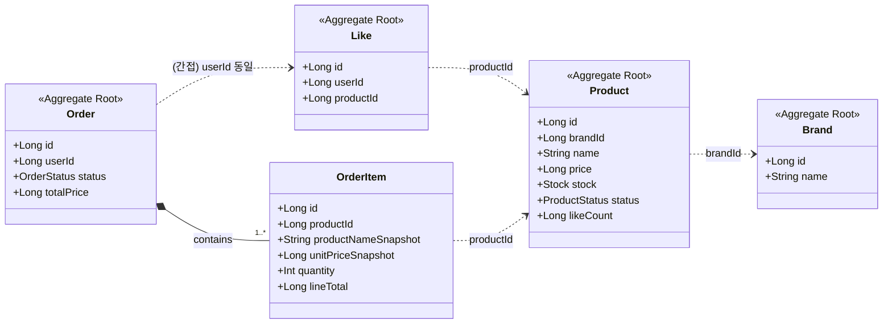
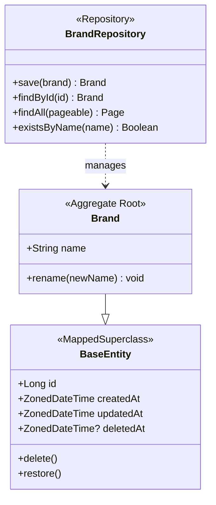
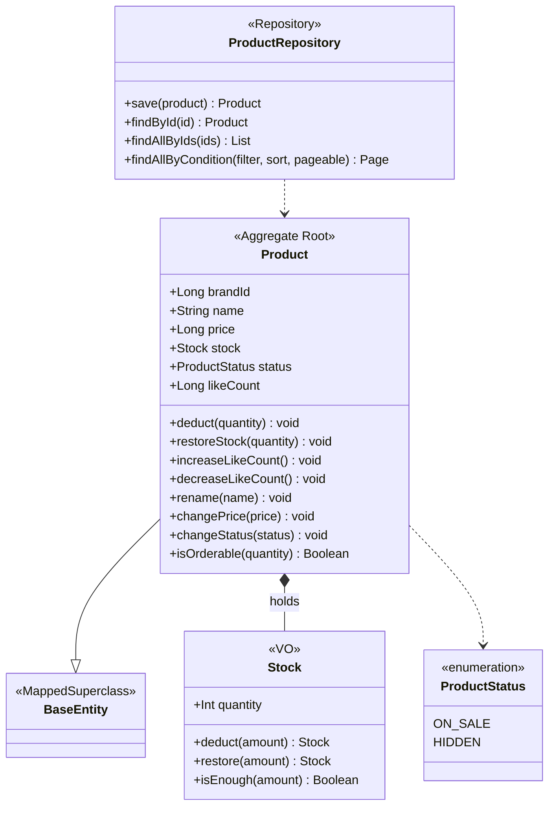
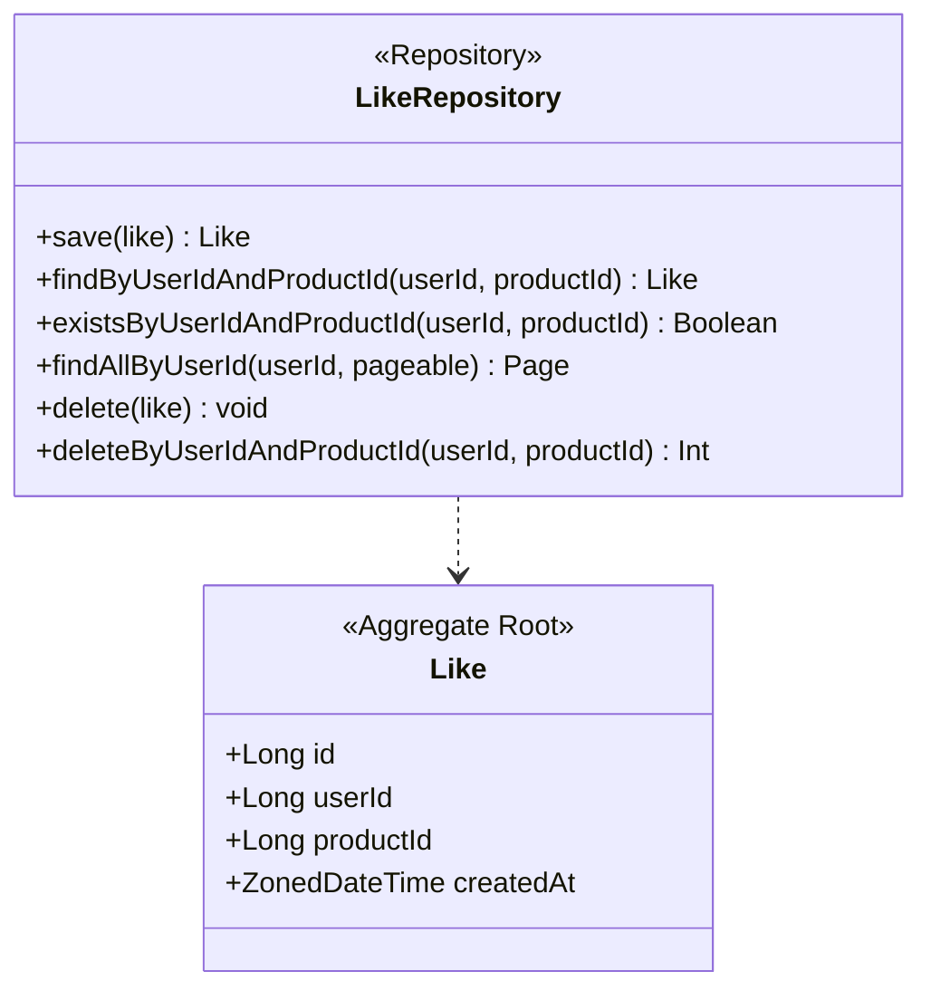
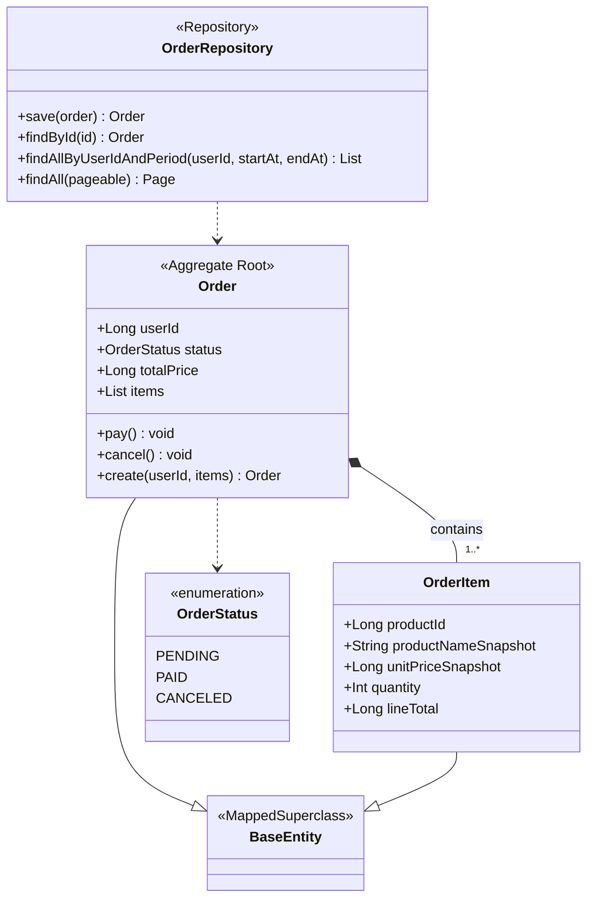
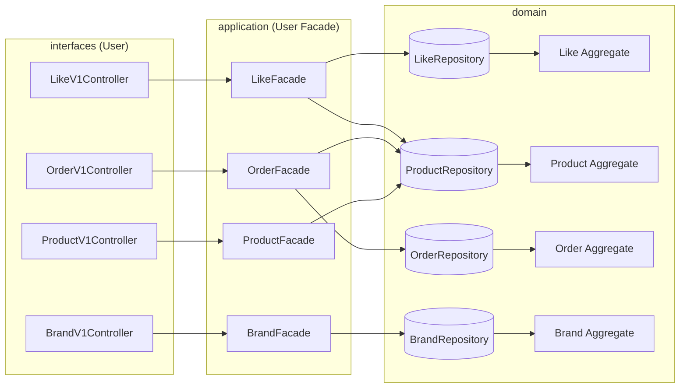
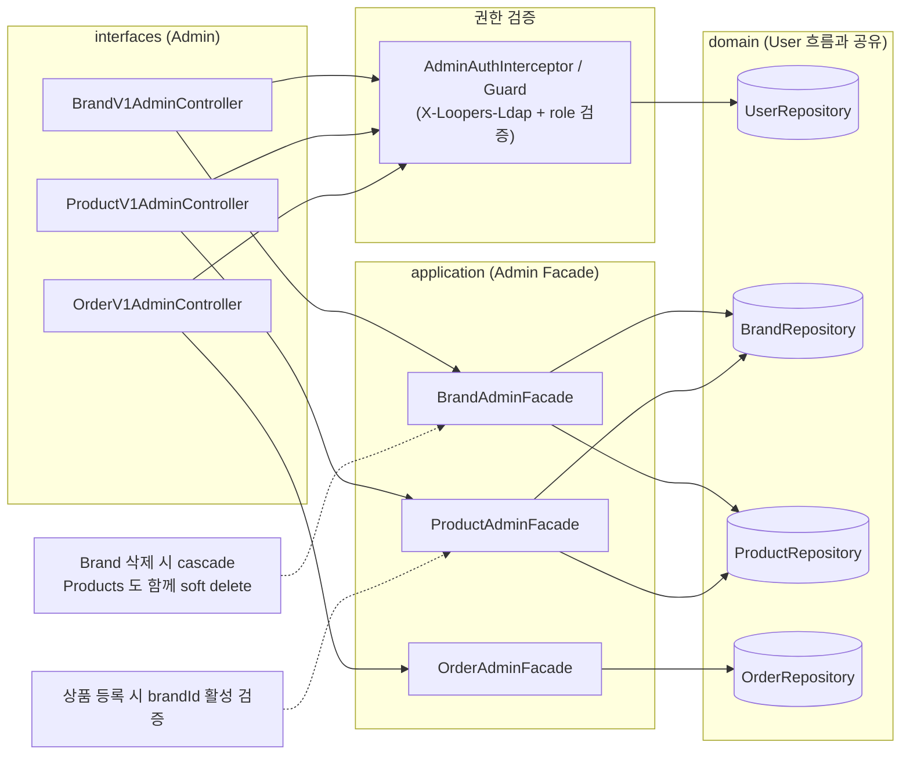

# 03. 도메인 모델 / 클래스 다이어그램

> 본 문서는 [01. 요구사항 명세](01-requirements.md) 의 결정을 토대로 도메인 객체의 구조와 책임을 정의한다.
> 모델링 스타일은 **DDD Aggregate 중심**이며, vol.1 의 `BaseEntity` 와 `XxxModel` 명명 규칙을 따른다.

## 목차

1. [모델링 원칙](#1-모델링-원칙)
2. [전체 조망 — Aggregate 한눈에 보기](#2-전체-조망--aggregate-한눈에-보기)
3. [Aggregate 별 상세](#3-aggregate-별-상세)
   - [3.1 Brand](#31-brand-aggregate)
   - [3.2 Product](#32-product-aggregate)
   - [3.3 Like](#33-like-aggregate)
   - [3.4 Order](#34-order-aggregate)
4. [Application Layer 조율 (참고)](#4-application-layer-조율-참고)
5. [잠재 리스크](#5-잠재-리스크)

---

## 1. 모델링 원칙

### 1.1 Aggregate 가이드

| 원칙 | 적용 |
| --- | --- |
| 트랜잭션 경계 = Aggregate 경계 | 한 Aggregate 단위로 일관성을 보장한다 |
| 외부에서는 Aggregate Root 만 참조 | 예: `OrderItem` 은 `Order` 를 통해서만 접근 |
| Aggregate 간은 **ID 참조** | `Product → brandId`, `OrderItem → productId` (객체 직접 참조 ❌) |
| Aggregate 는 작게 | Brand–Product 를 한 Aggregate 로 묶지 않는다 |

### 1.2 정합성 예외 (의도된 두-Aggregate 트랜잭션)

엄격한 DDD 는 "한 TX = 하나 Aggregate" 를 권장하지만, 본 도메인에서는 **즉시 정합성을 위해** 의도적으로 두 Aggregate 를 같은 TX 에 묶는다.

| 케이스 | 묶이는 Aggregate | 조율 위치 |
| --- | --- | --- |
| 좋아요 등록/취소 | `Like` + `Product.like_count` | `application/like/LikeFacade` |
| 주문 생성 | `Order` + `Product.stock` | `application/order/OrderFacade` |

조율은 항상 **Application Layer (Facade)** 가 책임진다 ([§4 참고](#4-application-layer-조율-참고)).

### 1.3 명명 / 상속 규칙

- Aggregate Root / Entity 는 모두 `XxxModel` 접미사를 사용한다 (vol.1 `UserModel` 과 동일).
- 영속화 가능한 모든 클래스는 `modules/jpa` 의 `BaseEntity` 를 상속한다.
  - `id: Long`, `createdAt/updatedAt: ZonedDateTime`, `deletedAt: ZonedDateTime?` 자동 관리
  - `delete()` 메서드는 멱등 처리되어 있음
- VO 는 불변(`data class` 또는 `value class` 가 자연스러움), `<<VO>>` 스테레오타입으로 표기한다.
- 상태값은 `enum class` 로 표현한다.
- 필드는 `var ... protected set` 으로 캡슐화하여 도메인 메서드를 통한 변경만 허용한다.

> 이하 다이어그램에서는 표현 단순화를 위해 `XxxModel` 대신 `Xxx` 로 표기한다. 실제 클래스명은 `XxxModel` 이다.

---

## 2. 전체 조망 — Aggregate 한눈에 보기

이 다이어그램에서 확인할 포인트:
- 4개의 Aggregate Root (Brand / Product / Like / Order)
- Aggregate 간은 **ID 참조** 만 존재 (점선 의존성)
- `Order` 만 내부 엔티티 `OrderItem` 을 컴포지션으로 가짐



> 점선(`..>`) = ID 참조 (객체 참조 아님). 실선 다이아몬드(`*--`) = 컴포지션 (`Order` 의 생명주기에 종속).

---

## 3. Aggregate 별 상세

### 3.1 Brand Aggregate

#### 책임
- 브랜드의 고유 이름을 관리한다.
- 자기 자신의 생성/수정/삭제만 책임진다 (소속 상품의 cascade 삭제는 Facade 에서 조율).

#### 클래스 다이어그램



#### 불변 규칙
- `name` 은 비어있을 수 없다.
- `name` 은 시스템 전체에서 unique (DB `UNIQUE (name)`, 활성/비활성 무관).
- **이름 unique 충돌 시 자동 restore** — `BrandFacade` 가 등록 요청을 받을 때, 동일 이름의 soft delete 된 행이 있으면 그 행을 `restore()` 하고 요청 필드를 반영한다. 새로운 `INSERT` 는 발생하지 않는다.

---

### 3.2 Product Aggregate

#### 책임
- 상품의 가격·재고·노출 상태·좋아요 수를 캡슐화한다.
- 재고 차감/복구, 좋아요 수 ±1 같은 **원자 단위 도메인 연산**을 제공한다.

#### 클래스 다이어그램



#### 불변 규칙
- `price ≥ 0`, `Stock.quantity ≥ 0`, `likeCount ≥ 0`.
- `brandId` 는 등록 후 변경 불가 (도메인 메서드로 노출하지 않는다).
- `isOrderable(quantity)` 는 `deletedAt == null && status == ON_SALE && stock.isEnough(quantity)` 일 때 `true`.

#### 동시성 (정책 선언, 구현은 다음 주)
- `deduct`, `restoreStock`, `increaseLikeCount`, `decreaseLikeCount` 는 **동시 호출에서도 음수가 되지 않아야** 한다.
- 구체 패턴(원자적 UPDATE / 비관 락 / 낙관 락) 은 구현 단계에서 결정한다.

---

### 3.3 Like Aggregate

#### 책임
- (User, Product) 조합당 1개의 좋아요 표시를 보장한다.
- 자체 상태가 거의 없고 단순 표식 역할만 한다. `Product.like_count` 갱신은 `LikeFacade` 가 조율한다.

> **특이사항** — Like 는 본 도메인에서 유일하게 **hard delete** 를 사용한다. 따라서 `BaseEntity` 를 상속하지 않고 `id` / `createdAt` 만 자체 정의한다 (`updatedAt`, `deletedAt` 없음). 이력 보존을 포기하는 대신 unique 제약 충돌 처리가 단순해진다.

#### 클래스 다이어그램



#### 불변 규칙
- `(userId, productId)` 조합은 최대 1개 (DB `UNIQUE (user_id, product_id)`).
- DB unique 제약이 일차 방어선. 애플리케이션은 unique 제약 위반을 정상 흐름으로 흡수한다.
- 좋아요 취소는 `LikeRepository.delete()` / `deleteByUserIdAndProductId()` 호출로 행을 물리적으로 제거한다. 미존재 행에 대한 호출은 no-op 으로 간주 (영향행 0).
- `Like` 는 생성 후 변경되지 않는다 (`updatedAt` 불필요).

---

### 3.4 Order Aggregate

#### 책임
- 한 사용자의 주문 단위를 표현하며, 내부의 `OrderItem` 들을 합산한 `totalPrice` 를 관리한다.
- 상태 전이(`PENDING → PAID`, `PENDING/PAID → CANCELED`) 를 자체 메서드로만 허용한다.

#### 클래스 다이어그램



#### 불변 규칙
- `items.size ≥ 1`.
- 각 `OrderItem` 의 `lineTotal = unitPriceSnapshot × quantity`.
- `totalPrice = Σ items.lineTotal`. 외부에서 직접 세팅할 수 없으며, 팩토리 메서드 `Order.create(...)` 안에서 계산된다.
- 스냅샷 필드(`productNameSnapshot`, `unitPriceSnapshot`) 는 생성 후 변경되지 않는다.

#### 상태 전이

| 현재 | 액션 | 다음 | 비고 |
| --- | --- | --- | --- |
| `PENDING` | `pay()` | `PAID` | 외부 결제 성공 시 |
| `PENDING` | `cancel()` | `CANCELED` | 결제 실패/사용자 취소 → 재고 복구 트리거 (Facade) |
| `PAID` | `cancel()` | `CANCELED` | 환불 흐름 → 재고 복구 + 환불 트리거 (결제 도메인에서 다룸) |

> 재고 복구는 `Order` 가 직접 하지 않는다. `cancel()` 호출 후 `OrderFacade` 가 `OrderItem` 들을 순회하며 `Product.restoreStock(quantity)` 을 트리거한다.

---

## 4. Application Layer 조율 (참고)

도메인 모델 자체에 포함되지는 않지만, 두 Aggregate 가 함께 변경되는 흐름은 항상 Facade 에서 같은 트랜잭션으로 묶인다.

### 4.1 LikeFacade

#### 좋아요 등록

```
LikeFacade.like(userId, productId)
└─ @Transactional
   ├─ product = productRepository.findById(productId) ?: throw NOT_FOUND
   ├─ if (likeRepository.existsByUserIdAndProductId(...)) return     ← 멱등 흡수
   ├─ likeRepository.save(Like(userId, productId))
   └─ product.increaseLikeCount() → productRepository.save(product)
```

> 동시 좋아요 시 unique 제약 위반은 catch → 멱등 흡수.

#### 좋아요 취소 (hard delete)

```
LikeFacade.unlike(userId, productId)
└─ @Transactional
   ├─ affected = likeRepository.deleteByUserIdAndProductId(userId, productId)
   ├─ if (affected == 0) return                                       ← 미존재 멱등
   ├─ product = productRepository.findById(productId) ?: throw NOT_FOUND
   └─ product.decreaseLikeCount() → productRepository.save(product)
```

> `delete...` 가 영향행 0 이면 좋아요가 원래 없었던 것 → no-op 반환으로 멱등 보장.

### 4.2 OrderFacade (주문 생성)

```
OrderFacade.place(userId, requestedItems)
└─ @Transactional
   ├─ products = productRepository.findAllByIds(requestedItems.map { it.productId })
   ├─ 각 product 에 대해 isOrderable(quantity) 검증 → 하나라도 실패면 throw  (all-or-nothing)
   ├─ products 각각 deduct(quantity)  → productRepository.save 일괄
   ├─ orderItems = requestedItems × productSnapshot 으로 생성
   ├─ order = Order.create(userId, orderItems)
   └─ orderRepository.save(order)
```

### 4.3 의존성 다이어그램

User 흐름과 Admin 흐름이 같은 도메인 Aggregate / Repository 를 공유한다. Facade 만 유즈케이스 단위로 분리된다.

#### User 흐름



#### Admin 흐름



#### 읽는 포인트
- **Facade 만 유즈케이스 단위로 분리** — Repository / Aggregate / Entity 는 User 흐름과 100% 공유.
- 어드민 권한 검증은 진입점 (`AdminAuthInterceptor` 또는 각 `*AdminFacade` 의 첫 단계) 에서 한 번 일어난다. 검증 통과 후엔 일반 도메인 흐름과 동일.
- `BrandAdminFacade.delete` 가 같은 트랜잭션 안에서 `Brand` 와 그 브랜드의 `Product` 들을 함께 soft delete (cascade) → [`02-sequence-diagrams.md` §5`](02-sequence-diagrams.md#5-브랜드-cascade-soft-delete--delete-api-adminv1brandsbrandid) 참고.

---

## 5. 잠재 리스크

| 리스크 | 영향 | 완화 방안 |
| --- | --- | --- |
| `Product.likeCount` hot row 경합 | 인기 상품에서 좋아요 등록/취소 시 락 경합 ↑ | 원자적 UPDATE (`SET like_count = like_count + 1`) — 구현 단계 결정 |
| `Product.stock` 동시 차감 | 동시 주문에서 음수 재고 위험 | 원자적 UPDATE `WHERE stock >= ?` 패턴, 영향행 0 시 재고 부족 — 구현 단계 결정 |
| 두-Aggregate TX 의 결합 | `Like` ↔ `Product`, `Order` ↔ `Product` 가 서로 영향 | 정합성 확보를 우선. 추후 트래픽이 커지면 비동기 카운팅으로 분리 검토 (Open Question) |
| 브랜드 cascade 삭제 | Facade 가 `Brand.delete()` + 모든 `Product.delete()` 를 한 TX 에서 처리 시 상품이 많으면 TX 비대화 | 상품 수가 많아질 경우 배치/페이지 단위 cascade 로 분리 검토 |
| 스냅샷 누락 | 상품명/가격이 변하면 과거 주문 표시가 어긋남 | 스냅샷 필드를 `OrderItem` 의 불변 컬럼으로 강제 (이번 모델에서 적용) |
| `Like` hard delete 의 이력 손실 | "이 사용자가 과거에 좋아요 했었음" 데이터가 남지 않아 통계/분석 불가 | 통계 요구가 생기면 별도 이벤트 로그(`like_events`) 도입 또는 soft delete 회귀 검토 — Open Question |
