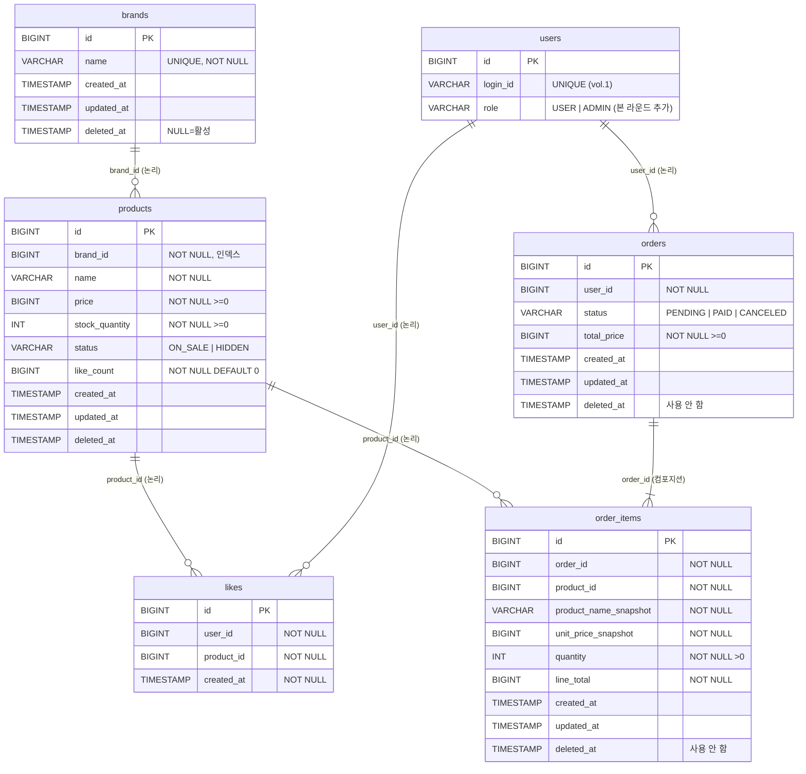

# 04. ERD (Entity-Relationship Diagram)

> [01. 요구사항](01-requirements.md) 과 [03. 클래스 다이어그램](03-class-diagram.md) 의 결정을 물리 스키마로 옮긴 문서다.
> 다음 주 DDL/JPA 매핑 작성 시 본 문서를 기준으로 한다.

## 목차

1. [설계 원칙](#1-설계-원칙)
2. [전체 ERD](#2-전체-erd)
3. [테이블별 상세](#3-테이블별-상세)
   - [3.1 brands](#31-brands)
   - [3.2 products](#32-products)
   - [3.3 likes](#33-likes)
   - [3.4 orders](#34-orders)
   - [3.5 order_items](#35-order_items)
   - [3.6 users (vol.1, 참고)](#36-users-vol1-참고)
4. [인덱스 정책 요약](#4-인덱스-정책-요약)
5. [정합성·무결성 정책](#5-정합성무결성-정책)
6. [잠재 이슈](#6-잠재-이슈)

---

## 1. 설계 원칙

| 원칙 | 적용 |
| --- | --- |
| **FK 제약 X** | 모든 Aggregate 간 관계는 컬럼 + 인덱스로만 표현한다. 무결성은 애플리케이션이 책임. Aggregate 내부(`orders ↔ order_items`)도 FK 를 걸지 않는다. |
| **soft delete 통일** | `Brand`, `Product`, `Order`, `OrderItem` 은 `BaseEntity` 상속을 통해 `deleted_at` 을 가진다. 단 `Order` / `OrderItem` 은 실제로 soft delete 를 사용하지 않으며 컬럼만 존재한다 (취소는 `status = CANCELED` 로 표현). |
| **`Like` 만 hard delete** | `likes` 테이블은 `deleted_at`/`updated_at` 컬럼이 없다. 행을 물리적으로 INSERT/DELETE 한다. |
| **시간 타입** | 모든 시간 컬럼은 `TIMESTAMP` (애플리케이션 `ZonedDateTime` 과 매핑). |
| **금액·수량** | 금액은 `BIGINT` (원 단위, ≥ 0), 수량은 `INT` (≥ 0). |
| **상태값** | 도메인 enum 은 `VARCHAR` 로 저장 (값 자체로 의미 식별 가능, 코드 테이블 분리하지 않음). |
| **인덱스 표기 규칙** | `pk_*`, `uk_*` (unique), `ix_*` (일반 인덱스). |
| **PK** | 모든 테이블 `id BIGINT AUTO_INCREMENT` (`BaseEntity.id` 와 일치). |

---

## 2. 전체 ERD

확인할 포인트:
- 관계선은 **논리 관계** 만 표현하고 DB FK 는 없음을 §1 에서 명시
- `orders ↔ order_items` 만 강한 컴포지션 (실선), 그 외는 ID 참조 (점선)

> 관계선의 의미: `||--o{` = 1-to-many (선택). `||--|{` = 1-to-many (필수, 최소 1). 모두 **DB FK 가 아닌 논리적 관계** 다.

---

## 3. 테이블별 상세

### 3.1 brands

브랜드 마스터. 어드민만 CRUD.

| 컬럼 | 타입 | NULL | 기본값 | 설명 |
| --- | --- | :---: | --- | --- |
| `id` | `BIGINT` | NN | `AUTO_INCREMENT` | PK |
| `name` | `VARCHAR(100)` | NN | — | 브랜드 이름. 활성/비활성 무관 unique |
| `created_at` | `TIMESTAMP` | NN | `CURRENT_TIMESTAMP` | `BaseEntity` |
| `updated_at` | `TIMESTAMP` | NN | `CURRENT_TIMESTAMP` | `BaseEntity` |
| `deleted_at` | `TIMESTAMP` | Y | `NULL` | soft delete |

**인덱스**

| 이름 | 컬럼 | 종류 | 용도 |
| --- | --- | --- | --- |
| `pk_brands` | `id` | PK | — |
| `uk_brands_name` | `name` | UNIQUE | 이름 중복 차단. soft delete 된 행도 포함하므로, 동일 이름 재등록 시 `BrandFacade` 가 `restore()` 처리 |

---

### 3.2 products

상품 본문. 좋아요 수를 역정규화로 보관.

| 컬럼 | 타입 | NULL | 기본값 | 설명 |
| --- | --- | :---: | --- | --- |
| `id` | `BIGINT` | NN | `AUTO_INCREMENT` | PK |
| `brand_id` | `BIGINT` | NN | — | 브랜드 ID (FK 제약 없음, 인덱스만) |
| `name` | `VARCHAR(200)` | NN | — | 상품명 |
| `price` | `BIGINT` | NN | — | 단가 (원). 도메인에서 ≥ 0 강제 |
| `stock_quantity` | `INT` | NN | `0` | 재고 수량. 도메인에서 ≥ 0 강제 |
| `status` | `VARCHAR(20)` | NN | `'ON_SALE'` | `ON_SALE` / `HIDDEN` |
| `like_count` | `BIGINT` | NN | `0` | 좋아요 수 (역정규화). 도메인에서 ≥ 0 강제 |
| `created_at` | `TIMESTAMP` | NN | — | `BaseEntity` |
| `updated_at` | `TIMESTAMP` | NN | — | `BaseEntity` |
| `deleted_at` | `TIMESTAMP` | Y | `NULL` | soft delete |

**인덱스**

| 이름 | 컬럼 | 종류 | 용도 |
| --- | --- | --- | --- |
| `pk_products` | `id` | PK | — |
| `ix_products_brand_id` | `brand_id` | INDEX | 브랜드별 필터·cascade soft delete |
| `ix_products_status_deleted` | `(status, deleted_at)` | INDEX | 대고객 목록 조회 (`status=ON_SALE AND deleted_at IS NULL`) |
| `ix_products_like_count` | `like_count` | INDEX | `sort=likes_desc` 정렬 |
| `ix_products_price` | `price` | INDEX | `sort=price_asc` 정렬 |
| `ix_products_created_at` | `created_at` | INDEX | `sort=latest` 정렬 |

> 정렬 인덱스는 모두 단일 컬럼. 페이지 깊이가 깊어지면 복합 인덱스(`(status, deleted_at, like_count)` 등) 도입 검토.

---

### 3.3 likes

좋아요 표식. **이 테이블만 hard delete** 사용.

| 컬럼 | 타입 | NULL | 기본값 | 설명 |
| --- | --- | :---: | --- | --- |
| `id` | `BIGINT` | NN | `AUTO_INCREMENT` | PK |
| `user_id` | `BIGINT` | NN | — | 사용자 ID (FK 제약 없음) |
| `product_id` | `BIGINT` | NN | — | 상품 ID (FK 제약 없음) |
| `created_at` | `TIMESTAMP` | NN | `CURRENT_TIMESTAMP` | 자체 정의 (`BaseEntity` 미상속) |

**인덱스**

| 이름 | 컬럼 | 종류 | 용도 |
| --- | --- | --- | --- |
| `pk_likes` | `id` | PK | — |
| `uk_likes_user_product` | `(user_id, product_id)` | UNIQUE | 한 사용자가 한 상품에 최대 1개. 멱등성의 일차 방어선 |
| `ix_likes_user_created` | `(user_id, created_at)` | INDEX | "내 좋아요 목록" 최신순 페이징 |

> `updated_at`, `deleted_at` 컬럼 없음 — Like 는 생성 후 변경되지 않고, 취소 시 행을 물리 삭제한다.

---

### 3.4 orders

주문 헤더.

| 컬럼 | 타입 | NULL | 기본값 | 설명 |
| --- | --- | :---: | --- | --- |
| `id` | `BIGINT` | NN | `AUTO_INCREMENT` | PK |
| `user_id` | `BIGINT` | NN | — | 주문자 (FK 제약 없음) |
| `status` | `VARCHAR(20)` | NN | `'PENDING'` | `PENDING` / `PAID` / `CANCELED` |
| `total_price` | `BIGINT` | NN | — | 주문 합계. `Σ order_items.line_total` 와 일치해야 함 |
| `created_at` | `TIMESTAMP` | NN | — | `BaseEntity` |
| `updated_at` | `TIMESTAMP` | NN | — | `BaseEntity` |
| `deleted_at` | `TIMESTAMP` | Y | `NULL` | 컬럼만 존재. 주문 취소는 `status = CANCELED` 로 표현 (soft delete 안 함) |

**인덱스**

| 이름 | 컬럼 | 종류 | 용도 |
| --- | --- | --- | --- |
| `pk_orders` | `id` | PK | — |
| `ix_orders_user_created` | `(user_id, created_at)` | INDEX | 본인 주문 목록 기간 조회 |
| `ix_orders_status` | `status` | INDEX | 어드민 상태 필터 |
| `ix_orders_created` | `created_at` | INDEX | 어드민 전체 목록 페이징 |

---

### 3.5 order_items

주문 라인. 주문 시점의 상품 정보를 스냅샷으로 보관.

| 컬럼 | 타입 | NULL | 기본값 | 설명 |
| --- | --- | :---: | --- | --- |
| `id` | `BIGINT` | NN | `AUTO_INCREMENT` | PK |
| `order_id` | `BIGINT` | NN | — | 소속 주문 ID (FK 제약 없음, 인덱스) |
| `product_id` | `BIGINT` | NN | — | 상품 ID (FK 제약 없음) |
| `product_name_snapshot` | `VARCHAR(200)` | NN | — | 주문 시점 상품명 (불변) |
| `unit_price_snapshot` | `BIGINT` | NN | — | 주문 시점 단가 (불변) |
| `quantity` | `INT` | NN | — | 수량. > 0 |
| `line_total` | `BIGINT` | NN | — | `unit_price_snapshot * quantity`. 계산 후 저장 |
| `created_at` | `TIMESTAMP` | NN | — | `BaseEntity` |
| `updated_at` | `TIMESTAMP` | NN | — | `BaseEntity` |
| `deleted_at` | `TIMESTAMP` | Y | `NULL` | 사용 안 함 |

**인덱스**

| 이름 | 컬럼 | 종류 | 용도 |
| --- | --- | --- | --- |
| `pk_order_items` | `id` | PK | — |
| `ix_order_items_order_id` | `order_id` | INDEX | 주문 상세 조회 시 라인 fetch |

> 스냅샷 컬럼은 도메인에서 **생성 후 절대 갱신 금지**. 코드 레벨에서 `protected set` 으로 강제한다.

---

### 3.6 users (vol.1 + 본 라운드 `role` 컬럼 추가)

vol.1 에서 생성된 테이블에 본 라운드에서 **`role` 컬럼을 추가**한다. 이 컬럼은 어드민 식별의 기준이 된다 (`X-Loopers-Ldap` 헤더 매핑은 [`01-requirements.md` §2.1`](01-requirements.md#21-액터) 참고).

| 컬럼 | 타입 | NULL | 기본값 | 설명 |
| --- | --- | :---: | --- | --- |
| `id` | `BIGINT` | NN | — | PK |
| `login_id` | `VARCHAR` | NN | — | UNIQUE. `X-Loopers-LoginId` 및 `X-Loopers-Ldap` 매칭 키 |
| `password` | `VARCHAR` | NN | — | BCrypt |
| `name` | `VARCHAR` | NN | — | — |
| `birth_date` | `DATE` | NN | — | — |
| `email` | `VARCHAR` | NN | — | — |
| `role` | `VARCHAR(20)` | NN | `'USER'` | **본 라운드 추가.** `USER` / `ADMIN`. 어드민 검증 기준 |
| `created_at` / `updated_at` / `deleted_at` | `TIMESTAMP` | — | — | `BaseEntity` |

**시드 데이터** (개발/테스트 환경)
- `login_id = 'loopers.admin', role = 'ADMIN'` 사용자 1명. 시나리오의 `X-Loopers-Ldap = loopers.admin` 헤더와 매칭된다.

**인덱스 정책**
- 기존: `uk_users_login_id (login_id)` — vol.1.
- 추가 X. `role` 은 카디널리티가 낮아 인덱스 효용이 낮다. 향후 어드민 사용자가 다수가 되면 검토.

---

## 4. 인덱스 정책 요약

| 테이블 | 인덱스 | 비고 |
| --- | --- | --- |
| `brands` | `uk_brands_name` | unique, restore 정책의 일차 방어선 |
| `products` | `ix_products_brand_id` | cascade soft delete · 브랜드별 조회 |
| `products` | `ix_products_status_deleted` | 대고객 목록 |
| `products` | `ix_products_like_count` / `ix_products_price` / `ix_products_created_at` | 정렬 3종 |
| `likes` | `uk_likes_user_product` | 멱등성 핵심 |
| `likes` | `ix_likes_user_created` | 마이 좋아요 |
| `orders` | `ix_orders_user_created` | 본인 기간 조회 |
| `orders` | `ix_orders_status` / `ix_orders_created` | 어드민 |
| `order_items` | `ix_order_items_order_id` | 라인 fetch |

> 모든 인덱스는 일반 B-tree 가정. 필요 시 다음 주 구현 단계에서 EXPLAIN 으로 검증 후 복합 인덱스 추가.

---

## 5. 정합성·무결성 정책

DB FK 가 없으므로 다음 항목은 **애플리케이션이 보장**한다.

| 보장 대상 | 책임 위치 | 방식 |
| --- | --- | --- |
| `products.brand_id` 가 실제 활성 브랜드 | `ProductFacade` (Admin) | 등록·수정 시 `brandRepository.findById` 로 활성 여부 확인 |
| 브랜드 cascade soft delete | `BrandFacade.delete` | 같은 트랜잭션에서 `products` 의 `deleted_at` 일괄 업데이트 |
| `order_items.product_id` 의 유효성 | `OrderFacade.place` | 주문 생성 시 상품 검증 |
| `orders.total_price = Σ order_items.line_total` | `Order.create()` 팩토리 | 합계는 도메인이 계산, 외부 세팅 불가 |
| `Product.like_count ≥ 0` | `Product.increase/decreaseLikeCount()` | 도메인 메서드 안 검증 |
| `Product.stock_quantity ≥ 0` | `Stock.deduct()` | VO 안 검증 |
| Like 멱등성 | `LikeFacade` + DB unique | 등록은 catch + idempotent, 취소는 deleteBy + 영향행 0 = no-op |
| 어드민 권한 검증 | Admin 라우트 진입점 (예: `AdminAuthInterceptor` 또는 각 `*AdminFacade`) | `X-Loopers-Ldap` 헤더 값으로 `users.findByLoginId` → `role == ADMIN` 확인. 실패 시 거부 |

---

## 6. 잠재 이슈

| 이슈 | 영향 | 대응 |
| --- | --- | --- |
| FK 없음 → 고아 행 가능 | 코드 버그 시 dangling reference (예: 존재하지 않는 `brand_id`) | Aggregate 별 facade 가 입력 검증. 통합 테스트로 cascade 검증 |
| `Product.like_count` 와 `likes` 카운트 불일치 가능 | 트랜잭션 중 예외 시 두 테이블 갱신이 어긋날 위험 | 같은 `@Transactional` 안에서 처리, 운영 단계에서 주기적 reconciliation 배치 검토 |
| 인기 상품의 `like_count` hot row | UPDATE 경합 | 다음 주 구현 단계에서 원자적 UPDATE / 비관 vs 낙관 락 비교 |
| `orders.deleted_at` 컬럼이 사용되지 않음 | 스키마와 사용 정책의 미일치 | 코드 컨벤션 문서/주석에 "주문은 soft delete 사용 안 함" 명시 |
| 정렬 인덱스 단일 컬럼 | 깊은 페이지에서 성능 저하 가능 | EXPLAIN 후 `(status, deleted_at, like_count)` 같은 복합 인덱스 도입 검토 |
| Brand 이름 영구 식별자 정책 | 어드민이 같은 이름을 재등록하면 과거 brand 가 부활. 어드민이 의도와 다를 수 있음 | 응답에 "기존 브랜드가 복원되었습니다" 같은 안내 메시지 검토 (UX) |
| `users.role` 단일 enum 의 한계 | 어드민 권한이 세분화되면 (상품 어드민/주문 어드민 등) 단일 `role` 컬럼으로는 부족 | 후속 라운드에서 `user_roles` (M:N) 또는 권한 시스템 도입 검토 |
| LDAP 헤더 단순 매칭 | `X-Loopers-Ldap` 를 `users.login_id` 와 직접 매칭하는 본 라운드 단순화는 실제 LDAP 응답 구조와 다름 | 실제 LDAP 연동 시 `users.ldap_id` 별도 컬럼 추가, 또는 SSO 토큰 검증 미들웨어 도입 검토 |
